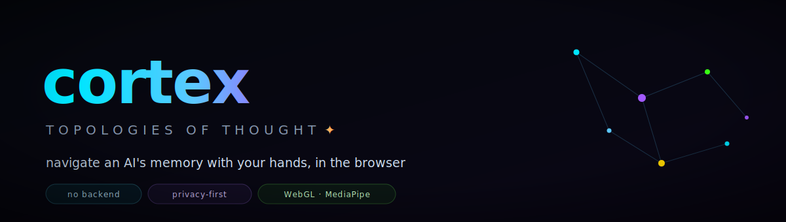
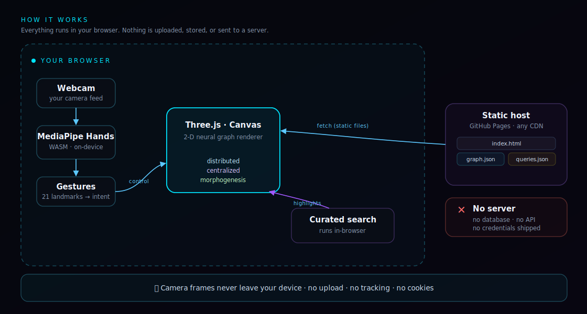

<p align="center">
  
</p>

<p align="center">
  
  
  
  
  
</p>

<p align="center">
  A browser visualization of an AI's memory graph that you navigate with hand gestures, using your webcam.<br>
  Hand tracking, rendering and search all run client-side: no backend, no database, nothing uploaded.
</p>

<!--
  Demo preview: drop a screenshot or GIF here when ready.
  <p align="center"></p>
-->

---

## What is this?

cortex shows a graph of "memories" (short notes, tagged and linked) that you move through with your hands. The webcam tracks your hands: your fingertip acts as an attractor that pulls the nearest nodes, a pinch selects a node, a fist grabs and drags the whole field, and two fists zoom. One hand collapses the graph around a single focus; two hands spread it back into a mesh.

It all runs locally in the browser. No server is involved beyond serving the files.

## How it works

<p align="center">
  
</p>

- **In-browser vision.** MediaPipe Hands reads 21 hand landmarks from the webcam, compiled to WebAssembly and running on-device. Camera frames are never sent anywhere; there is no server-side vision.
- **The graph.** Node positions, links, tags and previews are stored in two flat files (`graph.json`, `queries.json`). A small Three.js / Canvas renderer draws and animates them, with three layout modes: distributed, centralized, morphogenesis.
- **Search.** Curated example queries highlight matching nodes; free text falls back to a substring filter. Everything is computed in the page, with no API call.
- **Hosting.** It's a static bundle, so it can be served from anywhere (GitHub Pages, a CDN, or `python -m http.server`). The server only ever sends static files.

## Privacy

Hand detection runs locally in WebAssembly. No image, video or camera frame is uploaded, stored or transmitted, and there is no analytics, no cookies and no tracking. The memory data is synthetic: the notes are generated, not anyone's real information. The page sets a strict Content-Security-Policy and ships no credentials.

## Gestures

| Gesture | Action |
|---|---|
| Open hand | point; your fingertip is the attractor |
| Quick pinch | select the aimed node |
| Fist + move | grab and drag the whole field |
| Two fists | zoom (move hands apart or together) |
| One hand / two hands | centralized or distributed layout |

Without a camera, a mouse-only mode lets the attractor follow the cursor (wheel to zoom, drag to pan, `R` to reset).

## Run it locally

```bash
# single self-contained file, just open it
open cortex-demo.standalone.html

# or serve the bundle like in production
python3 -m http.server 8080
# then open http://localhost:8080
```

The webcam needs a secure context (HTTPS or `localhost`).

## Project structure

```
index.html                   the app: Three.js graph + MediaPipe, client-side
graph.json                   260 synthetic nodes (4 regions) + links
queries.json                 8 curated searches with frozen results
cortex-demo.standalone.html  single-file build (data inlined)
gen_demo_data.py             regenerates the demo data (deterministic)
assets/                      hero + architecture artwork
```

To regenerate the demo data:

```bash
python3 gen_demo_data.py
```

## About the data

cortex-demo is the public, synthetic-data version of a larger personal memory system. The real memory it is based on (a self-hosted vector store of notes) stays private and is not included here. Everything shown in the demo is generated.

## Tech

Vanilla JavaScript, Three.js / Canvas 2D, MediaPipe Tasks-Vision (WASM), and a Content-Security-Policy. No build step, no dependencies to install.

## License

MIT, see [`LICENSE`](LICENSE).
